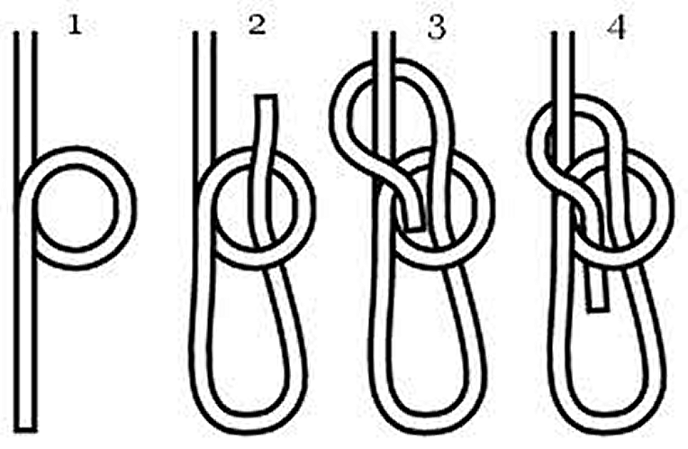
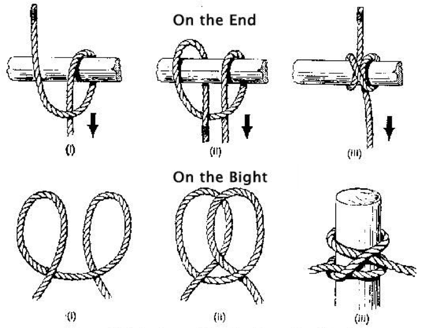

# Useful knots in the field

Inevitably, everybody in the field has had to make a knot in the field to tigh, to attach, to pull hard things, etc. Well with a knowledge of a minimum number of knots, you can make your life easy. 

## The bowline knot

[Eric Tabarly](http://www.sailing.org/halloffame/eric_tabarly.php), a famous French sailer when interviewed in the 1960s about knots he knew and most used famously answered: the bowline; and others? - the bowline! Indeed the bowline knot is probably one of the very best and useful knot there is: it never slips and can easily be undone, even after having put on a heavy load. 

> The bowline is an ancient and simple knot used to form a fixed 'eye' at the end of a rope. It has the virtues of being both easy to tie and untie; most notably, it is easy to untie after being subjected to a load. The bowline is sometimes referred to as King of the knots because of its importance. It is one of the four basic maritime knots (the other three are figure-eight knot, reef knot and clove hitch) [@Wikipedia_contributors2018-fd].

</br>

```{r "bowline", eval=TRUE, echo=FALSE, out.width = '60%', fig.align = 'center', fig.cap="1. The rabbit hole. 2. Out comes the rabbit, 3. runs around the tree, and 4. hops back into its hole."}

```

</br>

And in a video:

</br>

```{r "bowlinevideo", echo=FALSE, out.width = '80%', fig.align = 'center', fig.cap="tying a bowline knot from [animatedknots.com](https://www.animatedknots.com/)"}
knitr::include_url("https://www.youtube.com/embed/YXRnPES0Qec")
```

</br>

## The clove hitch

It is often considered one of the most important knots and is commonly referred to as a Double Hitch [@Wikipedia_contributors2018-qh]. Unlike the bowline which has a loop of given dimension, the clove hitch tightens around an object and prevents slipping on the given object. 

</br>

```{r "clove-hitch", eval=TRUE, echo=FALSE, out.width = '60%', fig.align = 'center', fig.cap="Tying the clove hitch: on the end and on the bight"}

```

</br>

```{r "clove-hitchvideo", echo=FALSE, out.width = '80%', fig.align = 'center', fig.cap="tying a clove hitch on the end from [animatedknots.com](https://www.animatedknots.com/)"}
knitr::include_url("https://www.youtube.com/embed/pwdZTHu5rTI")
```
</br>
```{r "clove-hitchvideo2", echo=FALSE, out.width = '80%', fig.align = 'center', fig.cap="tying a clove hitch on the bight from [animatedknots.com](https://www.animatedknots.com/)"}
knitr::include_url("https://www.youtube.com/embed/shTbWHxYiWk")
```
</br>
